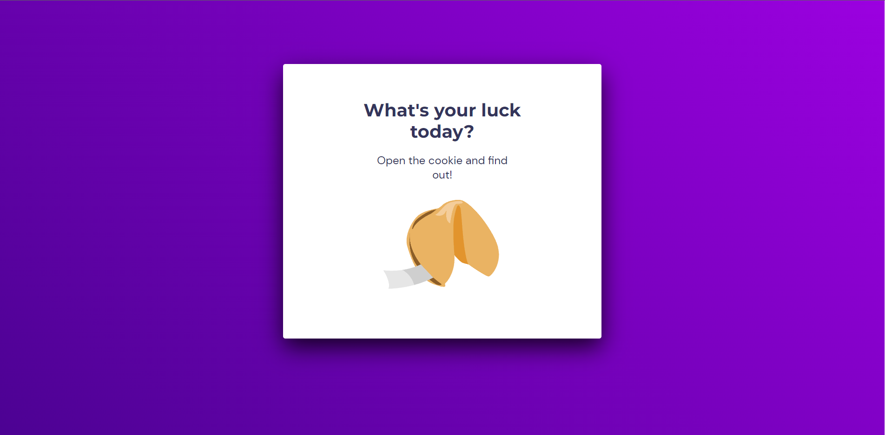
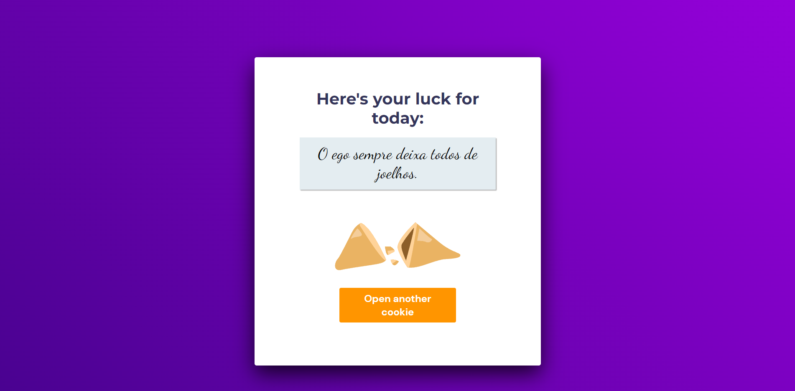

<h1 align="center"> Projeto - Biscoito da sorte 🤞</h1>

Hora de colocar em prática o que foi ensinado na primeira fase do stage 05 e o que foi visto nos stages anteriores.

  <a href="#-tecnologias">Tecnologias</a>&nbsp;&nbsp;&nbsp;|&nbsp;&nbsp;&nbsp;
  <a href="#-projeto">Projeto</a>&nbsp;&nbsp;&nbsp;|&nbsp;&nbsp;&nbsp;
  <a href="#-layout">Layout</a>&nbsp;&nbsp;&nbsp;|&nbsp;&nbsp;&nbsp;
  <a href="#memo-licença">Licença</a>

  

 

## 🚀 Technologies used in the project

It was produced with the following

&nbsp;
&nbsp;
&nbsp;

## 💻 Project

It's a game called Fortune Cookie, in which the user, with a click or enter, opens a cookie with the message of their luck of the day.

## 🔖 Layout do projeto

 
 

 
 Figma link: 
 
https://www.figma.com/file/SQogdymNTXHyzf3uOrVpXu/Biscoito-da-Sorte-(Community)?node-id=104%3A2&t=7WA4ObhiUOftNC8Q-0

 

## Apprenticeship

- Arrays;
- Functions in Javascript;
- DOM manipulation;
- HTML data structure;
- Animations with CSS;
- JS Math() library;
- Functions *callback*;

 
 

## Site online

---
